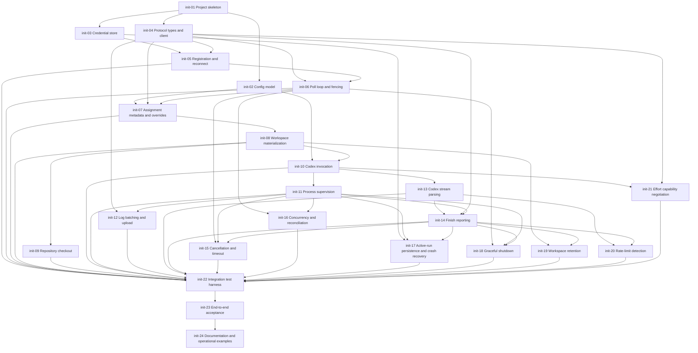

# `tines-runner-rs` implementation issues

This document decomposes the `tines-runner-rs` proposal into implementation issues.

Proposal context: [`docs/tines-runner-rs-proposal.md`](./tines-runner-rs-proposal.md)

Each issue has a stable bootstrap ID of the form `init-NN`.

`depends-on` lists issues that must be substantially complete before the issue can be considered complete. An empty list means the issue can begin independently.

## Dependency graph

---

## init-01 — Create the Rust project skeleton

proposal: `docs/tines-runner-rs-proposal.md`

depends-on: []

Create the `tines-runner-rs` crate and establish the basic executable structure.

Requirements:

- Use a conventional Rust binary crate layout.
- Establish modules for configuration, credentials, protocol/client, runner lifecycle, workspace handling, process supervision, logging, and Codex-specific behavior.
- Add structured logging/tracing suitable for a long-running daemon.
- Expose a version string in the binary.
- Add baseline formatting, linting, and test commands.
- Keep the crate independent from the Tines monorepo and `@tines/shared`.

Acceptance criteria:

- The binary builds and starts.
- `--version` reports the runner version.
- CI can run formatting, linting, and tests.

---

## init-02 — Implement TOML configuration and override resolution

proposal: `docs/tines-runner-rs-proposal.md`

depends-on: [init-01]

Implement the non-secret `config.toml` model.

Requirements:

- Parse:
  - server URL;
  - runner name;
  - runner type;
  - workspace parent;
  - wrapper argv;
  - max concurrency;
  - poll interval;
  - credential-file location;
  - workspace-retention settings.
- Initially accept only `runner_type = "codex"`.
- Model runner type as an enum suitable for future extension.
- Support ordered `[[override]]` entries with optional selectors:
  - `project`;
  - `workflow`;
  - `state`.
- Support override values:
  - `workspace_parent`;
  - `runner_type`;
  - `wrapper`.
- Match selector names exactly and case-insensitively.
- Require every selector on an override to match.
- Apply all matching overrides in declaration order.
- Later matching values replace earlier values field-by-field.
- Expand `~` and platform/XDG defaults predictably.
- Do not interpret `wrapper` through a shell.

Acceptance criteria:

- Unit tests cover project-only, workflow-only, state-only, and combined selectors.
- Unit tests cover overlapping matches and declaration-order precedence.
- The resolved per-run config is independent of the raw configuration representation.

---

## init-03 — Implement secure runner credential storage

proposal: `docs/tines-runner-rs-proposal.md`

depends-on: [init-01]

Implement `credentials.toml` and bootstrap-key handling.

Requirements:

- Keep the long-lived runner token out of the ordinary `config.toml`.
- Default to a credentials file under the runner configuration directory.
- Store:
  - runner ID;
  - runner token.
- On Unix, create or repair the credentials file with mode `0600`.
- Read the user bootstrap API key from `TINES_API_KEY`.
- Never persist the bootstrap API key.
- Support a configurable credentials-file path.
- Avoid logging runner tokens or API keys.
- Provide clear errors for malformed or unreadable credential files.

Acceptance criteria:

- Fresh credentials are written with restrictive permissions.
- Existing credentials can be reloaded.
- Unit tests verify secrets are excluded from debug/log rendering.

---

## init-04 — Define Tines runner protocol types and HTTP client

proposal: `docs/tines-runner-rs-proposal.md`

depends-on: [init-01]

Implement the minimal direct REST client required by the local runner.

Requirements:

- Model the request/response shapes needed for:
  - runner registration;
  - runner polling;
  - run-log append;
  - run finish;
  - assigned issue detail lookup.
- Treat unknown response fields as forward-compatible where practical.
- Implement bearer authentication with:
  - runner token for runner-protocol endpoints;
  - run key for issue-detail lookup.
- Support configurable Tines base URL.
- Classify HTTP failures into:
  - authentication;
  - fencing/conflict;
  - retryable transport/server error;
  - non-retryable protocol/client error.
- Implement bounded request timeouts.
- Never log bearer credentials.

Acceptance criteria:

- Serialization/deserialization fixtures cover the protocol subset used by the runner.
- HTTP error classification is unit tested.

---

## init-05 — Implement runner registration and reconnect

proposal: `docs/tines-runner-rs-proposal.md`

depends-on: [init-03, init-04]

Implement first-run registration and subsequent reconnect behavior.

Requirements:

- If stored credentials exist, reconnect using the stored runner token.
- If credentials do not exist, require `TINES_API_KEY`.
- Register a local Codex runner with:
  - name;
  - harness type;
  - local max concurrency;
  - hostname/platform metadata where supported.
- Persist the returned runner ID and token.
- Do not persist the user API key.
- If a stored runner token is rejected, fail closed with a clear diagnostic.
- Do not silently fall back from a rejected runner token to `TINES_API_KEY`.

Acceptance criteria:

- Fresh registration persists reusable credentials.
- A second start does not require the bootstrap API key.
- Rejected credentials produce a deterministic operator-facing error.

---

## init-06 — Implement the runner poll loop and daemon fencing

proposal: `docs/tines-runner-rs-proposal.md`

depends-on: [init-04, init-05]

Implement the long-running poll loop.

Requirements:

- Generate one random `instance_id` per daemon boot.
- Send `owned_runs` on each poll.
- Send local concurrency information required by the current protocol.
- Receive:
  - assignments;
  - cancellation requests;
  - concurrency-control updates;
  - released assignments where applicable.
- Implement retry/backoff for transient poll failures.
- Keep running child processes alive during poll outages.
- Handle `409 runner_conflict` by exiting the superseded daemon.
- Handle runner-token rejection as a fatal authentication error.
- Support a draining flag for later graceful-shutdown integration.

Acceptance criteria:

- A fake server can hand out an assignment.
- Temporary poll failures recover without losing local run state.
- A simulated `runner_conflict` terminates the daemon.

---

## init-07 — Resolve assignment project/workflow/state configuration

proposal: `docs/tines-runner-rs-proposal.md`

depends-on: [init-02, init-04, init-06]

Build the immutable local match context for an assignment and resolve its effective config.

Requirements:

- Read project name from `assignment.run.issue_ref.project_name`.
- Read state name from `assignment.run.state_at_start_name`.
- Fetch `GET /api/v1/issues/{issue_id}` using the assignment run key.
- Read workflow name from the issue detail's embedded workflow.
- Resolve the effective runner configuration using project/workflow/state overrides.
- Log which selectors matched without logging secrets.
- Fail the assignment clearly if required match metadata cannot be obtained.
- Document the current workflow-name race caused by using current issue detail with immutable state-at-start data.

Acceptance criteria:

- Integration tests verify project, workflow, state, and combined overrides.
- Override matching remains case-insensitive.

---

## init-08 — Materialize a cold-run workspace

proposal: `docs/tines-runner-rs-proposal.md`

depends-on: [init-07]

Create the on-disk workspace expected by the Tines launch prompt.

Requirements:

- Create one unique workspace per run beneath the effective workspace parent.
- Write `prompt.md`.
- Write `repos.json`.
- Materialize effective skills under `.agents/skills/<name>/...`.
- Replace only the generated skills subtree.
- Preserve path safety:
  - no traversal;
  - no writes outside the workspace;
  - no secret-bearing names.
- Deliver assignment environment metadata for later process launch.
- Treat materialization failure as an assignment-local run failure.

Acceptance criteria:

- Fixture assignments produce the expected workspace tree.
- Malicious/invalid skill paths are rejected safely.

---

## init-09 — Clone effective repositories

proposal: `docs/tines-runner-rs-proposal.md`

depends-on: [init-08]

Implement repository checkout for a cold run.

Requirements:

- Clone every effective repo described by the assignment bundle.
- Use the machine's normal Git credentials.
- Honor configured base branches from Tines.
- Clone into the workspace-relative `dir` supplied by Tines.
- Stream Git progress/errors into the run log path once log delivery is available.
- Treat clone/checkout failure as run failure.
- Avoid shell command construction; invoke Git using argv.

Acceptance criteria:

- Tests cover:
  - successful clone;
  - requested branch;
  - invalid repository;
  - duplicate/conflicting destination path.

---

## init-10 — Implement Codex command construction and wrapper execution

proposal: `docs/tines-runner-rs-proposal.md`

depends-on: [init-02, init-08]

Implement the Codex harness adapter.

Requirements:

- Construct the native-equivalent Codex structured-output invocation.
- Pass the model selected by Tines.
- Accept the resolved effort value once capability negotiation is available.
- Run with the workspace as the working directory.
- Prefix the Codex argv with the effective wrapper argv.
- Never use an intermediate shell for wrapper execution.
- Pass the assignment run key via environment, not argv.
- Set:
  - `TINES_API_KEY`;
  - `TINES_API_URL`;
  - delivered assignment environment variables.
- Redact secret environment values from diagnostics.

Acceptance criteria:

- Unit tests verify exact argv construction with and without a wrapper.
- The run key never appears in formatted launch diagnostics.

---

## init-11 — Implement process-group supervision

proposal: `docs/tines-runner-rs-proposal.md`

depends-on: [init-10]

Implement safe lifecycle control for Codex and its descendants.

Requirements:

- Spawn Codex/wrapper as a process group or equivalent platform abstraction.
- Capture stdout and stderr.
- Track child identity before awaiting long-running work.
- Support graceful termination followed by forced termination.
- Return reliable exit status/signal information.
- Avoid leaving grandchildren behind on cancellation or timeout.
- Expose a process identity suitable for crash recovery without relying on PID alone where the platform permits.

Acceptance criteria:

- Tests with a stub harness prove descendants are terminated.
- Exit-code and signal outcomes are distinguishable.

---

## init-12 — Implement batched sequenced run-log delivery

proposal: `docs/tines-runner-rs-proposal.md`

depends-on: [init-04, init-11]

Stream logs to Tines with retry-safe ordering.

Requirements:

- Batch stdout/stderr output.
- Assign a 1-based monotonically increasing per-run `seq`.
- Retry transient append failures using the same sequence number.
- Never advance the sequence until the batch is accepted.
- Preserve output order as closely as practical.
- Flush pending valid logs before ordinary finish.
- Stop sending logs after supervisor cancellation/settlement.
- Add launch and exit diagnostic lines with secrets redacted.

Acceptance criteria:

- Tests prove a retried batch is not duplicated.
- Tests cover network failure during a multi-batch stream.

---

## init-13 — Parse and render Codex JSONL

proposal: `docs/tines-runner-rs-proposal.md`

depends-on: [init-10]

Implement Codex-specific structured stream handling.

Requirements:

- Parse `codex exec --json` output incrementally.
- Render readable run-log lines for:
  - agent text;
  - tool activity;
  - shell commands where present;
  - session/thread information;
  - provider errors.
- Preserve enough raw structured information to derive terminal usage/pricing evidence.
- Tolerate unknown additive event types.
- Do not crash the run solely because an unknown JSON event appears.

Acceptance criteria:

- Fixtures from representative Codex streams render deterministically.
- Unknown events are ignored or rendered safely.

---

## init-14 — Implement finish reporting

proposal: `docs/tines-runner-rs-proposal.md`

depends-on: [init-04, init-11, init-13]

Report ordinary run completion to Tines.

Requirements:

- Report `completed` for successful harness completion.
- Report `failed` for ordinary non-zero/materialization/harness failure.
- Include applicable:
  - error text;
  - provider thread/session ID;
  - input/output/cache-read/cache-write usage;
  - Codex pricing evidence.
- Preserve usage already observed when the harness later fails.
- Represent unavailable usage honestly rather than synthesizing values.
- Only clean up the workspace after local settlement is complete.

Acceptance criteria:

- Fake-server tests validate completed and failed finish payloads.
- Usage/session extraction is present when the stream supplies it.

---

## init-15 — Implement timeout and supervisor cancellation

proposal: `docs/tines-runner-rs-proposal.md`

depends-on: [init-06, init-11, init-14]

Handle server-driven and local time limits correctly.

Requirements:

- Enforce `assignment.timeout_minutes`.
- On local timeout:
  - terminate the process group;
  - report the appropriate failure/termination result.
- On a run ID appearing in poll `cancels`:
  - terminate the local process group;
  - stop log delivery;
  - do not call `finish`, because Tines has already settled the run.
- Correctly handle cancellation while:
  - enriching assignment metadata;
  - materializing workspace;
  - cloning;
  - running Codex.

Acceptance criteria:

- Tests cover cancellation before process spawn and while running.
- A canceled run never emits a second finish.

---

## init-16 — Implement concurrency and ownership reconciliation

proposal: `docs/tines-runner-rs-proposal.md`

depends-on: [init-06, init-11]

Support multiple simultaneous runs safely.

Requirements:

- Enforce configured `max_concurrent`.
- Track all accepted/in-flight assignments locally.
- Include local run IDs in `owned_runs`.
- Support the current runner-protocol concurrency-control response fields.
- If remote concurrency adjustment is enabled later in configuration, never allow it to exceed the local ceiling.
- Handle server-released assignments without launching them.
- Ensure accepted work is inserted into local tracking before asynchronous materialization begins.

Acceptance criteria:

- With max concurrency 2, at most two harnesses execute simultaneously.
- Reconciliation after a simulated poll outage does not duplicate work.

---

## init-17 — Persist active-run state and recover after crashes

proposal: `docs/tines-runner-rs-proposal.md`

depends-on: [init-03, init-11, init-14]

Implement crash-safe local state.

Requirements:

- Persist active-run metadata including:
  - run ID;
  - process/process-group identity;
  - workspace path.
- Write state atomically.
- Clear entries after local settlement.
- On startup:
  - read prior active state;
  - verify process identity safely;
  - terminate surviving orphan harnesses;
  - report recoverable runs as `interrupted` where permitted;
  - clean up abandoned workspaces according to policy.
- Avoid killing unrelated processes after PID reuse.
- Reconcile with Tines through `owned_runs` after recovery.

Acceptance criteria:

- Kill the runner process during a stub run, restart it, and verify the orphan harness is terminated.
- Stale PID reuse cannot cause an unrelated process to be killed in tests where process identity can be simulated.

---

## init-18 — Implement graceful shutdown and draining

proposal: `docs/tines-runner-rs-proposal.md`

depends-on: [init-06, init-11, init-14]

Handle SIGINT/SIGTERM deterministically.

Requirements:

- Mark the daemon draining.
- Stop accepting new assignments.
- Continue any minimum polling required to communicate draining/cancellation state.
- Terminate in-flight harnesses in a controlled way when shutting down.
- Report runner-caused termination with `judgment: "interrupted"` when appropriate.
- Flush valid pending logs before settlement where possible.
- Persist/clear active-run state consistently.
- Exit only after local run ownership is resolved.

Acceptance criteria:

- SIGTERM during a run leaves no child processes.
- The run is not misreported as an issue failure caused by the agent.

---

## init-19 — Implement debugging workspace retention and pruning

proposal: `docs/tines-runner-rs-proposal.md`

depends-on: [init-08, init-14]

Support retained workspaces without implementing resume.

Requirements:

- Support retention modes:
  - `never`;
  - `failed`;
  - `always`.
- Add a retained-workspace marker only after a run has settled.
- Marker fields include:
  - run ID;
  - issue reference when known;
  - terminal status;
  - error/reason when applicable;
  - retained timestamp.
- Prune by:
  - maximum age;
  - maximum retained count.
- Only delete directories containing a valid retained-workspace marker.
- Never treat unmarked directories as safe to delete.

Acceptance criteria:

- Retention mode behavior is unit tested.
- Pruning never deletes an unmarked directory.

---

## init-20 — Detect Codex rate limits and provider usage exhaustion

proposal: `docs/tines-runner-rs-proposal.md`

depends-on: [init-13, init-14]

Distinguish provider exhaustion from issue failure.

Requirements:

- Detect supported Codex rate-limit/usage-limit terminal signals.
- Extract reset/retry time where available.
- Finish with:
  - `judgment: "rate_limited"`;
  - `resume_at` when known.
- Preserve any usage/session information already observed.
- Avoid classifying unrelated provider errors as rate limiting.

Acceptance criteria:

- Recorded Codex fixtures cover known rate-limit forms.
- Ordinary authentication/model errors remain ordinary failures.

---

## init-21 — Advertise and enforce Codex effort capabilities

proposal: `docs/tines-runner-rs-proposal.md`

depends-on: [init-04, init-10]

Reach parity with Tines effort-aware local Codex routing.

Requirements:

- Detect the installed Codex version.
- Derive the effort levels supported by the exact installed harness/model contract used by Tines.
- Advertise effort capability information in runner polls.
- Refresh capability data when appropriate without probing on every poll.
- Apply assignment effort exactly when supported.
- Decline/reject assignments that require an unsupported or unverifiable effort rather than silently degrading.

Acceptance criteria:

- Fake-server tests verify advertised capabilities.
- Unsupported effort never launches Codex with a different effective setting.

---

## init-22 — Build a comprehensive fake-Tines integration test harness

proposal: `docs/tines-runner-rs-proposal.md`

depends-on: [init-05, init-06, init-07, init-08, init-09, init-10, init-11, init-12, init-13, init-14, init-15, init-16, init-17, init-18, init-19, init-20, init-21]

Create a deterministic test server and stub Codex executable for protocol-level testing.

Requirements:

- Fake:
  - registration;
  - poll assignment;
  - issue detail;
  - log append;
  - finish;
  - cancellation;
  - fencing;
  - transient failures.
- Stub Codex should be able to:
  - emit controlled JSONL;
  - sleep;
  - fork descendants;
  - exit successfully or unsuccessfully;
  - simulate rate limits;
  - emit usage and thread IDs.
- Provide scenarios for:
  - happy path;
  - wrapper execution;
  - override selection;
  - log retry;
  - cancellation;
  - timeout;
  - concurrency;
  - crash/restart;
  - graceful shutdown.

Acceptance criteria:

- Core runner behavior can be exercised without a live Tines deployment or provider account.

---

## init-23 — Add Tines end-to-end acceptance coverage

proposal: `docs/tines-runner-rs-proposal.md`

depends-on: [init-22]

Validate the runner against a real or isolated Tines instance.

Requirements:

- Register `tines-runner-rs` as a local runner.
- Route a test issue to it.
- Use a stub Codex executable to avoid provider cost.
- Verify:
  - assignment delivery;
  - project/workflow/state override selection;
  - workspace materialization;
  - run-key API access;
  - log streaming;
  - finish state;
  - cancellation;
  - daemon fencing/reconnect.
- Capture protocol regressions clearly.

Acceptance criteria:

- A repeatable acceptance command proves compatibility with the current Tines runner protocol.

---

## init-24 — Document operation and packaging boundaries

proposal: `docs/tines-runner-rs-proposal.md`

depends-on: [init-23]

Write user-facing operating documentation after behavior is stable.

Requirements:

- Document:
  - installation of the Rust binary;
  - `config.toml`;
  - `credentials.toml`;
  - bootstrap with `TINES_API_KEY`;
  - wrapper configuration;
  - project/workflow/state overrides;
  - Codex prerequisites;
  - expected Git credentials;
  - workspace retention;
  - troubleshooting token rejection and runner fencing.
- Provide example `systemd` and `launchd` configurations if useful, without implementing an installer.
- State explicitly that:
  - resume is future work;
  - daemon auto-update is out of scope;
  - service installation is out of scope;
  - Codex updates are operator-managed.
- Document the current extra issue-detail lookup used to resolve workflow name.

Acceptance criteria:

- A new operator can configure and run the daemon without reading the source.