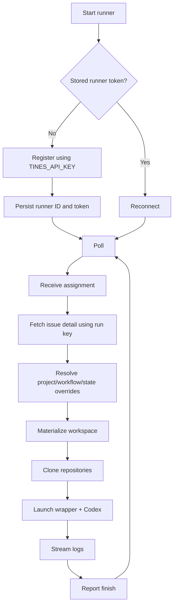

# Proposal: `tines-runner-rs`

## Summary

Build an independent local Tines runner in Rust, named `tines-runner-rs`.

The runner will speak the existing Tines local-runner protocol directly, poll for assigned work, materialize workspaces, launch Codex, stream logs, and report completion. The first version supports only the `codex` runner type, while keeping the configuration and internal interfaces open to future runner types such as Claude Code, Antigravity, and custom commands.

In addition to native-runner execution behavior, `tines-runner-rs` adds local execution-policy overrides selected by project, workflow, and workflow-state names. This allows the same registered runner to vary its workspace root, wrapper command, and eventually runner type according to the assigned issue.

Resume support, daemon self-update, and service-manager installation are explicitly deferred.

## Motivation

The native Tines local runner is coupled to the Tines CLI implementation and its Node/npm distribution model. An independent Rust runner provides:

- a small standalone binary with an independently controlled release lifecycle;
- a clear implementation of the local runner protocol;
- robust process supervision without depending on Node;
- local execution policy that can vary by project, workflow, or state;
- a path to additional harnesses without making Tines itself responsible for machine-specific launch policy.

The runner should remain compatible with Tines' existing scheduling model: Tines decides which runner receives an issue and which model/effort to request; `tines-runner-rs` decides how that assigned work is executed on the local machine.

## Goals

The initial implementation should:

- register or reconnect as a Tines local runner;
- poll the existing local-runner protocol without requiring inbound connectivity;
- support Codex as the only harness;
- support a configurable workspace parent directory;
- support an argv-based wrapper prefix around the Codex invocation;
- select execution configuration using case-insensitive project, workflow, and state-name matches;
- materialize the same effective prompt, skills, repositories, and environment delivered to native local runners;
- clone repositories with the runner machine's Git credentials;
- stream logs reliably to Tines;
- report Codex session/thread and usage evidence expected by Tines;
- correctly handle cancellation, timeout, graceful shutdown, daemon replacement, network interruption, and process recovery;
- support local concurrency and the current runner-protocol reconciliation model;
- provide debugging-oriented workspace retention and pruning.

## Non-goals

The initial implementation will not provide:

- resume/send-back continuation;
- preservation of workspaces for Tines resume semantics;
- automatic runner self-update;
- automatic installation or updating of the agent-facing `tines` CLI;
- `launchd` or `systemd` installation/uninstallation commands;
- automatic installation or updating of Codex;
- Claude Code, Antigravity, or custom harness execution;
- a new Tines scheduling or routing model;
- a required server-side Tines protocol change.

Operators are responsible for keeping the `tines` and `codex` executables used by the harness available and compatible. Example service-manager units may be documented later, but service installation is outside the runner itself.

## Configuration

### Files

The default configuration directory is:

```text
~/.config/tines-runner-rs/
```

or the platform/XDG-equivalent configuration directory.

It contains two separate files:

```text
config.toml
credentials.toml
```

`config.toml` contains non-secret runner configuration and may be managed like ordinary dotfiles.

`credentials.toml` contains the long-lived Tines runner token and must be created with restrictive permissions. On Unix, the runner should require or repair mode `0600`.

The configuration may expose a `credentials_file` setting to relocate the credential store, but secrets are not written into the main configuration by default.

### Bootstrap API key and runner token

A user API key is needed only when no stored runner credentials exist.

The bootstrap key is read from:

```text
TINES_API_KEY
```

The runner uses it to call the Tines runner-registration endpoint, then persists the returned runner ID and runner token in `credentials.toml`. The user API key is never persisted by `tines-runner-rs`.

Subsequent starts use only the persisted runner token.

If Tines rejects the stored runner token, the runner should fail closed with a clear diagnostic and require a fresh bootstrap using `TINES_API_KEY`. It must never silently fall back from a rejected runner token to an unrelated user credential.

A typical credentials file is:

```toml
runner_id = "rnr_..."
runner_token = "..."
```

### Main configuration

A representative initial configuration is:

```toml
[server]
url = "https://tines.tbuckley.dev"

[runner]
name = "workstation-codex"
runner_type = "codex"
workspace_parent = "~/.local/share/tines-runner-rs/workspaces"
wrapper = ["some-wrapper", "--"]
max_concurrent = 1
poll_interval_seconds = 15
allow_remote_concurrency = false

[storage]
credentials_file = "~/.config/tines-runner-rs/credentials.toml"
keep_workspaces = "never"
keep_workspaces_for_hours = 72
keep_workspaces_max = 20

[[override]]
project = "Tines"
wrapper = ["tines-wrapper", "--"]

[[override]]
workflow = "Implementation"
wrapper = ["implementation-wrapper", "--"]

[[override]]
project = "Tines"
workflow = "Implementation"
state = "Review"
wrapper = ["review-wrapper", "--"]
```

`wrapper` is an argv prefix, not a shell command string. For example:

```toml
wrapper = ["some-wrapper", "--"]
```

combined with:

```text
codex exec ...
```

must be spawned directly as:

```text
some-wrapper -- codex exec ...
```

without an intermediate shell.

### Runner types

The configuration model should deserialize runner type into a Rust enum.

The initial accepted value is:

```toml
runner_type = "codex"
```

The configuration shape should permit adding runner types later without redesigning the override system.

### Overrides

Each `[[override]]` entry has zero or more selectors:

- `project`
- `workflow`
- `state`

and zero or more execution fields:

- `workspace_parent`
- `runner_type`
- `wrapper`

An override matches only when every selector it specifies matches the assignment.

Project, workflow, and state selectors use exact name matching, case-insensitively. The first implementation does not support globbing, regular expressions, IDs, or negative matches.

Resolution is deterministic:

1. start with `[runner]` defaults;
2. evaluate `[[override]]` entries in declaration order;
3. apply every matching override;
4. later matching overrides replace earlier values for fields they specify.

This deliberately permits broad rules followed by narrow exceptions without introducing an implicit specificity algorithm.

Daemon-level settings such as `max_concurrent` and `poll_interval_seconds` are not per-assignment overrides.

## Assignment metadata and override matching

The current Tines assignment already provides:

- `run.issue_ref.project_name`;
- `run.state_at_start_name`;
- the assignment's ephemeral `run_key`.

It does not currently expose the workflow name directly on `RunnerAssignment`.

For the initial implementation, `tines-runner-rs` resolves the workflow by calling:

```http
GET /api/v1/issues/{run.issue_id}
Authorization: Bearer <run_key>
```

The issue detail includes the workflow definition and workflow name.

The match context is therefore conceptually:

```rust
MatchContext {
    project: assignment.run.issue_ref.project_name,
    workflow: issue.workflow.name,
    state: assignment.run.state_at_start_name,
}
```

The state-at-start name is preferred over the issue's current state because it identifies the stage that caused the run to be launched.

At runtime, the runner validates these required names and stores them in an owned match context before resolving overrides. It logs the project, workflow, state, and indexes of matching override entries. It does not log the run key or resolved execution values. If required metadata is missing or the issue-detail request fails, the runner logs the reason and declines the assignment.

There is a small race in the workaround: the issue-detail response contains the issue's current workflow, while the state name comes from the immutable run-start snapshot. If a human changes the issue workflow between dispatch and the lookup, the two names could describe different moments. This is acceptable for the initial implementation.

A future additive Tines protocol change could place an immutable `{ workflow_name, state_name }` launch-stage snapshot directly on `RunnerAssignment`, removing both the extra request and the race. That change is not required for this proposal.

## Runner lifecycle

The normal lifecycle is:



No inbound connection to the runner machine is required.

## Runner protocol

The implementation uses the existing Tines local-runner protocol, including:

- runner registration;
- polling;
- run-log append;
- run finish.

Polling should implement the protocol fields necessary for reliable local execution, including:

- a per-process `instance_id`;
- `owned_runs`;
- local concurrency information;
- cancellation handling as required by the current protocol;
- environment-delivery capability;
- Codex effort capabilities when implemented;
- draining when graceful shutdown or another deliberate drain state requires it.

A `409 runner_conflict` means a newer daemon instance has superseded this process. The superseded process must stop taking work and exit.

Authentication boundaries remain the same as the native runner:

- the long-lived runner token is used only for runner-protocol calls;
- the per-assignment `run_key` is exposed to the harness and is used for issue-scoped Tines API calls.

## Workspace materialization

Each run receives a dedicated directory beneath the effective `workspace_parent`.

The workspace should reproduce the native local-runner layout that the launch prompt expects:

```text
prompt.md
repos.json
.agents/
  skills/
    <skill>/
      SKILL.md
      ...
<cloned repositories>
```

The runner owns the generated `.agents/skills` subtree for the run.

For a cold launch it must:

- write the assignment prompt to `prompt.md`;
- write the effective repository metadata to `repos.json`;
- materialize the assignment's effective skills into `.agents/skills`;
- clone the listed repositories using the machine's Git credentials;
- honor the effective repository branch/base revision supplied by Tines;
- fail the run when required workspace or repository materialization fails.

The workspace path itself must not contain the run key or other secrets.

## Environment delivery

The Codex process receives at least:

- `TINES_API_KEY=<assignment run_key>`;
- `TINES_API_URL=<configured server URL>`;
- environment values delivered by the assignment.

Secret environment values must never be included in launch banners or runner logs.

The wrapper process and Codex inherit the same run environment unless a future runner-type adapter explicitly defines otherwise.

## Codex invocation

The Codex adapter should match the semantics of Tines' native Codex runner:

- use structured JSON output;
- use the model selected by Tines;
- apply the requested effort only when supported and verified by advertised capability;
- run in the materialized workspace;
- expose the run key only through the environment;
- prepend the configured wrapper argv before the Codex argv.

The exact Codex argv belongs in the Codex adapter rather than the generic runner loop.

## Logging

The runner streams harness output to Tines while the process runs.

Log delivery must:

- batch output rather than issue a request for every write;
- assign each batch a per-run monotonically increasing sequence number;
- retry transient failures without duplicating accepted batches;
- preserve ordering across stdout/stderr as closely as the process interface permits;
- stop appending after the supervisor has canceled/settled a run.

Codex JSONL should be rendered into readable run-log lines compatible in spirit with the native runner, including agent output, tool activity, session information, and errors.

Launch and exit diagnostics should identify the runner version, effective harness, model, effort, timeout, workspace, and wrapper/command without printing secrets.

## Codex usage, session, and pricing evidence

The Codex stream parser should retain the terminal information Tines expects from native local Codex runs, including:

- Codex thread/session identifier;
- input tokens;
- output tokens;
- cache-read tokens;
- cache-write tokens;
- invocation/measurement evidence required by Tines' Codex pricing path.

Usage already observed should be reported even when the harness exits unsuccessfully.

If no usable terminal usage record is observed, the run should be reported in the same unreported/incomplete manner expected by the server rather than inventing usage.

## Effort capability negotiation

When effort routing is enabled, the runner should detect the installed Codex version and advertise the effort capabilities supported by that exact local harness.

The runner must not claim an effort level it cannot faithfully apply.

An assignment requesting unsupported or unverifiable effort should be declined or rejected using the current runner-protocol semantics rather than silently running at a different effort.

This can land after basic execution but is part of Codex parity.

## Rate limiting

Codex provider usage-limit/rate-limit exits should be distinguished from ordinary issue failures.

Where the Codex output exposes a reset time, the runner should report:

- `judgment: "rate_limited"`;
- `resume_at` with the provider-indicated time.

This allows Tines to hold the runner appropriately rather than treating provider exhaustion as an issue failure.

## Process lifecycle

The runner must supervise the complete spawned process tree.

It must support:

- normal exit;
- assignment timeout;
- supervisor cancellation;
- graceful daemon shutdown;
- recovery after an ungraceful runner crash.

Timeout or local shutdown should terminate the child process group, using a bounded graceful-termination period before forced termination where appropriate.

A supervisor cancellation is different from a local failure: a run ID returned in `cancels` has already been settled by Tines. The runner kills the process and does not send a new finish report.

## Completion

For an ordinary process completion, the runner reports either `completed` or `failed` through the runner protocol.

The finish payload should include applicable:

- error text;
- Codex thread/session ID;
- usage;
- Codex pricing evidence;
- rate-limit judgment/reset time;
- interruption judgment for runner-caused interruption.

Workspace cleanup occurs only after the run has reached the correct local settled state.

## Concurrency and reconciliation

The runner enforces its configured local `max_concurrent`.

Polls advertise the locally owned run IDs so the server and runner can reconcile ownership after network interruption or restart.

The implementation should support the current local-runner concurrency-control contract, including Tines' remote cap adjustment when enabled, but the locally configured maximum remains an upper bound.

Assignment receipt and process launch must be tracked before asynchronous materialization so cancellation or shutdown cannot lose a run that is between "accepted" and "spawned".

## Crash recovery

The runner maintains a small persistent active-run state file containing enough information to recover safely after a daemon crash, including at least:

- run ID;
- child/process-group identity;
- workspace path.

On startup it should inspect prior active-run state, terminate surviving orphaned harness processes when they can be identified safely, and report those runs as interrupted when the protocol still permits it.

Recovery must avoid killing an unrelated process that reused a stale PID. Platform-specific process identity validation should therefore be part of the design rather than relying on PID alone.

After startup, `owned_runs` reconciliation with Tines remains authoritative for which runs the server still considers active.

## Graceful shutdown

On SIGINT/SIGTERM the runner should:

- enter a draining state;
- stop accepting new assignments;
- continue protocol polling as needed to communicate draining/cancellation state;
- terminate in-flight local harnesses in a controlled way if the process is actually shutting down;
- report runner-caused terminations as interrupted where appropriate;
- flush any log data that is still valid to send;
- persist/clear active-run state consistently.

The runner must not claim a successfully completed result for work it interrupted itself.

## Workspace retention

Resume is out of scope, but debugging retention remains useful.

Support:

- `never`;
- `failed`;
- `always`.

Retained workspaces should carry a small marker containing the run ID, issue reference when known, terminal status, and retention timestamp.

Pruning is bounded by:

- maximum age;
- maximum retained count.

Pruning must only delete directories carrying a valid retained-workspace marker, never an unmarked directory that could belong to an active run.

## Error and retry behavior

Transient network failures should use bounded exponential backoff with jitter.

The runner should distinguish:

- retryable transport/server failures;
- authentication rejection;
- daemon fencing/conflict;
- assignment-local materialization failure;
- harness failure;
- supervisor cancellation.

A failed poll must not cause already-running harnesses to be abandoned.

A rejected runner token or protocol incompatibility should fail closed with a clear error rather than repeatedly launching work under uncertain authority.

## Observability

Runner console logs should make it possible to determine:

- runner identity and server;
- daemon version;
- registration versus reconnect;
- current concurrency;
- assignment receipt;
- effective project/workflow/state match;
- which overrides matched;
- workspace path;
- repository materialization progress;
- effective wrapper plus Codex command with secrets redacted;
- process exit/timeout/cancellation;
- runner-protocol retries and reconciliation decisions.

Run logs sent to Tines should remain focused on launch diagnostics and harness activity rather than internal polling noise.

## Testing

The project should have unit coverage for:

- TOML parsing;
- case-insensitive override matching;
- ordered override composition;
- wrapper argv construction;
- credential persistence and file permissions;
- protocol serialization;
- log sequence/retry behavior;
- Codex JSONL parsing;
- usage/session extraction;
- rate-limit recognition;
- workspace path safety;
- retained-workspace pruning;
- active-run state recovery.

Integration tests should use a fake Tines runner-protocol server to exercise:

- registration;
- reconnect;
- assignment delivery;
- issue-detail lookup;
- workspace materialization;
- cancellation before spawn;
- cancellation while running;
- timeout;
- log retry/idempotency;
- finish;
- daemon fencing;
- crash/restart reconciliation.

An end-to-end acceptance test should run against a real or isolated Tines instance with a stub Codex executable so protocol behavior can be validated without provider cost.

## Success criteria

The proposal is complete when `tines-runner-rs` can:

- register as a local Tines runner and reconnect from stored runner credentials;
- accept a Codex assignment through the existing runner protocol;
- resolve project/workflow/state configuration correctly;
- materialize and clone the assignment workspace;
- execute the configured wrapper plus Codex command;
- stream readable logs without duplication;
- expose the run key and delivered environment safely;
- report terminal state, Codex session, usage, and pricing evidence;
- respond correctly to cancellation, timeout, daemon replacement, graceful shutdown, and crash recovery;
- run multiple assignments up to its configured concurrency safely;
- retain/prune debugging workspaces when configured;
- operate without resume, auto-update, or built-in service installation.
